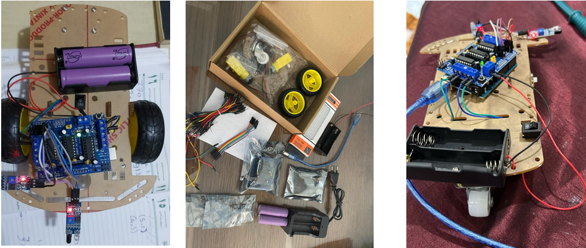

# Maze Runner

The Maze Solver Robot project aims to design and develop an autonomous robot capable of navigating through mazes using Infrared (IR) sensors. The primary objective is to build a robot that can detect walls and navigate through a maze using sensor data processed by an Arduino microcontroller. The project combines elements of robotics, sensor integration, and algorithm development. By leveraging the Arduino platform, the robot interprets signals from IR sensors to make decisions at maze junctions and navigate effectively. The expected outcome is a robot that can adapt to varying maze configurations and solve the maze in the shortest possible time. This project showcases the practical application of embedded systems and robotics in real-world problem-solving.

